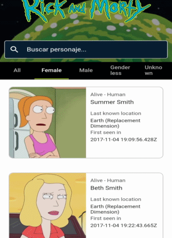

# RickAndMorty Demo APP

This is a Demo APP developed in Flutter. It use:

- BLoC pattern as State Management
- GetIt as Dependency Injector

## Demo APP
The APP looks like this:
<p align="center">
  
</p>

## Use Hive
This app saves cache for Http Requests with hive. Hive needs to be generated his code using this command:
```
fvm flutter pub run build_runner build --delete-conflicting-outputs
```
It create tha files XX.g.dart, which are the Adapters to use in the CacheRepository.

